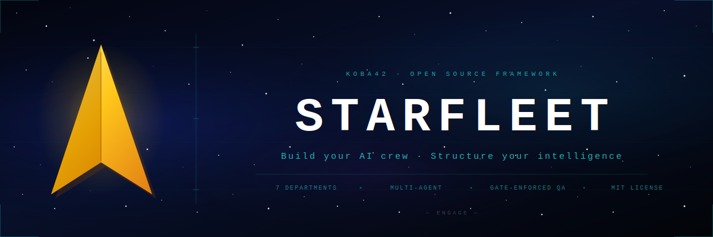

<div align="center">
  
</div>

<br>

<div align="center">

[](LICENSE)
[](https://claude.ai/code)
[](https://github.com/NousResearch/hermes-agent)
[]()
[]()

</div>

<br>

<div align="center">

*"Things are only impossible until they are not."*
**— Captain Jean-Luc Picard**

</div>

---

## What Is Starfleet?

Starfleet is a framework for building a structured, persona-driven AI agent crew — organized into departments, coordinated by an orchestrator, and deployed across any multi-agent runtime.

Most AI setups are a single assistant doing everything. Starfleet is different. It's a command hierarchy of specialist agents, each with a defined role, a clear domain, and a consistent voice. The orchestrator reads intent, routes work to the right specialist, enforces quality gates before anything advances, and synthesizes the output back to you.

The Star Trek framing is a mnemonic device. The underlying architecture — **orchestrator → departments → specialists → gates** — is a universal pattern for coordinating intelligent agents at scale. It applies anywhere complex organizations need to collaborate: software teams, law firms, marketing agencies, clinical research groups, government operations. Anywhere there are specializations, handoffs, and quality requirements.

This repository gives you the scaffold. The concepts, the department structure, the agent templates for Claude Code and Hermes, and enough theory to adapt it to your context. What you bring is your domain, your tools, and your crew.

---

## The Architecture

### The Command Hierarchy

```
You  (Starfleet Command)
 └── Orchestrator  (Fleet Captain)
       ├── Engineering     →  Senior Dev · Backend Architect · DevOps · Mobile · AI/ML · Security
       ├── Design          →  UX Architect · UI Designer · UX Researcher
       ├── Marketing       →  Content Creator · Growth Hacker · Community Manager
       ├── Product         →  Project Manager · Sprint Planner
       ├── QA & Testing    →  Reality Checker · Tool Evaluator · Workflow Optimizer
       ├── Analytics       →  Analytics Reporter · Finance Tracker
       └── Legal           →  Compliance Checker · Contract Reviewer
```

The orchestrator never does the domain work. It routes, sequences, and gates. That separation is what makes the system scale — an orchestrator that also codes is an orchestrator that rationalizes bad code.

### The Gate System

Every initiative passes five gates before it ships. No exceptions. No deadline overrides.

| Gate | Name | What it enforces |
|:---:|---|---|
| **0** | Scope | Objective, constraints, and done criteria are explicit |
| **1** | Plan | Tasks, dependencies, owners, and model tiers are assigned |
| **2** | Build | All implementation tasks are complete |
| **3** | Verify | QA, security, and legal checks have passed — with evidence |
| **4** | Release | Rollout plan, rollback plan, and human signoff exist |

The gate system is borrowed from engineering's concept of deployment checklists and extended to the full initiative lifecycle. Its value is not in catching catastrophic failures — it's in catching the small, easily-preventable ones that compound into catastrophic ones.

### The Build-QA Loop

Within Gate 2, every engineering task runs an inner loop:

```
Developer implements task
     └─► QA validates with evidence (not assertions)
           ├─ PASS → next task
           └─ FAIL → developer retries with specific feedback (max 3 attempts)
                └─ 3rd failure → escalate to human
```

This prevents two failure modes that kill projects: cascading bugs (bad task 2 breaks everything that depends on it) and false progress (marking things done without testing them).

### Model Tiering

Not every task needs your most capable model. Tiering keeps quality high where it matters and cost low where it doesn't.

| Tier | When | Examples |
|---|---|---|
| **A — Strategic** | Complex reasoning, high stakes | Orchestration, architecture, legal, security |
| **B — Build** | Skilled execution at volume | Implementation, QA analysis, data pipelines |
| **C — Execution** | Fast, high-volume, lower complexity | Research sweeps, first drafts, support docs |

Set the tier at the agent level. Override per task when warranted.

### The Persona Contract

Every agent has a defined persona. This is more than flavor — it's a behavioral contract:

> *A named agent with a defined voice behaves more predictably than a generic assistant.*

The persona specifies what the agent optimizes for, what it pushes back on, what it refuses to do, and how it communicates. When the QA agent always defaults to **NEEDS WORK** and requires evidence before passing anything, you can rely on that. When the legal agent always returns a risk level and a remediation path, not just a list of concerns, you can route its output downstream with confidence.

Personas create the consistent, specialized behavior that makes multi-agent coordination reliable. Without them, you have a swarm. With them, you have a crew.

---

## Universal Applications

The Starfleet pattern — orchestrator + departments + specialists + gates — is not a software engineering invention. It is a re-expression of how every high-performance organization already operates when it's working well: clear ownership, structured handoffs, quality checkpoints, and a coordinating layer that doesn't try to do everyone's job.

The AI layer makes it programmable, scalable, and tireless.

Here is how the pattern maps across industries.

---

### Software Development Teams

The most direct mapping. Starfleet's departments correspond almost exactly to how product companies organize:

| Starfleet Department | Org Equivalent |
|---|---|
| Command / PM | Product management, project coordination |
| Engineering | Engineering, platform, infrastructure |
| Design | Product design, UX research |
| QA | Quality engineering, release management |
| Analytics | Data, growth, business intelligence |
| Legal | Legal, privacy, compliance |
| Marketing | Marketing, content, DevRel |

The AI crew handles the coordination overhead — the standup summaries, the task breakdowns, the QA checklists, the spec-to-ticket conversion — freeing the human team for the decisions that actually require judgment. The gate system enforces the same discipline as code review, staging approvals, and deployment runbooks, but extends it to the full product lifecycle.

The orchestrator becomes the intelligent layer between your backlog and your team: it reads a spec, breaks it into tasks, routes each to the right specialist (AI or human), tracks dependencies, and flags blockers before they cascade.

---

### Marketing Agencies & Creative Studios

Creative work fails not because of lack of talent but because of coordination failure: brief misunderstandings, brand inconsistencies, approval bottlenecks, and last-minute legal holds.

A marketing crew reframes the departments:

- **Strategist** (Growth Hacker) — campaign positioning, channel mix, funnel design
- **Creative** (Content Creator) — copy, scripts, editorial
- **Community** (Community Manager) — social listening, authentic engagement
- **Analytics** (Analytics Reporter) — campaign performance, attribution, testing
- **Compliance** (Compliance Checker) — FTC, ASA, platform policy review

The gate system becomes a campaign pipeline: brief → creative → brand review → legal → publish. The reality checker catches brand inconsistencies before they go live. The compliance agent flags advertising regulation issues before they become enforcement actions.

The orchestrator manages concurrent campaigns across channels — routing briefs to the right creative specialist, sequencing approvals, and ensuring nothing publishes without clearing its required gates.

---

### Legal & Professional Services

Law firms and consulting practices are already organized around specialization and client matter routing. The challenge is that routing is manual, handoffs are informal, and quality control depends on individual diligence.

A legal crew maps as:

- **Research Specialist** — case law research, statutory analysis, precedent review
- **Document Analyst** — contract review, due diligence, document comparison
- **Client Communications** — draft correspondence, briefings, status updates
- **Compliance Officer** — regulatory filing requirements, jurisdiction-specific rules
- **Matter Coordinator** (PM role) — client matter workflow, deadline tracking

The gate system enforces the review steps that already exist in good legal practice but are often skipped under time pressure: no client-facing document leaves without review; no filing goes out without a compliance check; no matter proceeds without documented sign-off.

The orchestrator routes by matter type, jurisdiction, and urgency — giving each matter the right specialist at each stage without requiring a partner to manually coordinate every step.

---

### Financial Services

Finance operates at the intersection of two pressures that Starfleet is designed for: high specialization requirements and non-negotiable compliance obligations.

A financial services crew:

- **Research Analyst** — market research, investment thesis development, competitive analysis
- **Risk Analyst** — risk assessment, exposure modeling, scenario analysis
- **Client Services** — client reporting, portfolio summaries, inquiry responses
- **Compliance** — regulatory review (SEC, FINRA, MiFID II, Dodd-Frank), trade surveillance
- **Operations** — settlement, reconciliation, reporting, audit trails

The compliance gate is not optional in financial services — it maps directly to fiduciary duty and regulatory obligation. The gate system formalizes what regulation requires: no trade recommendation without documented risk review; no client communication without compliance sign-off; no report without an audit trail.

The model tiering principle maps cleanly to regulatory distinctions: advice that constitutes investment recommendation (Tier A, highest scrutiny) vs. general market commentary (Tier C, routine) vs. operational confirmation (Tier C).

---

### Healthcare & Life Sciences

Healthcare is perhaps the highest-stakes application of the Starfleet pattern. The combination of regulatory complexity, patient safety requirements, and multi-disciplinary collaboration makes the gate system not just useful but essential.

A clinical operations crew:

- **Clinical Research Specialist** — literature review, protocol design support, trial analysis
- **Regulatory Affairs** — FDA/EMA submission preparation, IND/NDA documentation
- **Patient Communications** — consent documentation, patient education materials
- **Medical Affairs** — publication planning, KOL engagement, medical information
- **Quality & Compliance** — GCP compliance, audit preparation, CAPA documentation

The gate system mirrors the phases of clinical development — each phase has defined exit criteria that must be met before the next phase begins. This is exactly what the Starfleet gate model enforces. Gate 3 (Verify) in a clinical context becomes: regulatory review passed, data integrity confirmed, protocol deviations documented.

The compliance agent's risk scale (BLOCKED / HIGH / MEDIUM / LOW / CLEAR) maps directly to how regulatory findings are triaged: critical observations vs. major observations vs. minor observations vs. no action required.

---

### E-Commerce & Retail

E-commerce operates at high velocity across many concurrent campaigns, SKUs, and channels. Coordination failure is expensive: a promotion launches with incorrect pricing, a campaign goes live in a region where the product isn't available, a product description misses a required safety disclosure.

A retail crew:

- **Merchandising Specialist** — product catalog management, pricing, inventory logic
- **Campaign Manager** (Growth Hacker) — promotion design, channel strategy, A/B testing
- **Customer Experience** — support response, returns handling, review management
- **Content Creator** — product copy, lifestyle content, email campaigns
- **Analytics** — sales performance, campaign ROI, customer lifetime value
- **Compliance** — product safety disclosures, regional regulatory requirements

The gate system enforces the availability and legal checks before campaign launch that manual processes routinely skip. The analytics agent feeds learnings from completed campaigns back to the planning phase. The orchestrator manages the concurrent workload — multiple campaigns in different stages of the pipeline — without human coordinators becoming bottlenecks.

---

### Consulting & Advisory Firms

Consulting engagements are fundamentally project-shaped: a scope, a set of deliverables, a client, and a deadline. The challenge is that engagement quality depends almost entirely on how well the team coordinates across research, analysis, synthesis, and delivery.

A consulting crew:

- **Research Specialist** — desk research, data gathering, expert source identification
- **Analyst** — data analysis, model building, hypothesis testing
- **Delivery Writer** — report writing, presentation development, executive summaries
- **Business Development** — proposal writing, capability statements, client targeting
- **Knowledge Manager** — methodology documentation, case study cataloging, IP capture

The gate system maps to engagement milestones: kickoff → diagnostic → analysis → recommendations → delivery. Each gate requires artifacts (interview notes, data models, validated findings) before the next phase begins. This prevents the consulting failure mode where the team runs out of time during analysis and delivers recommendations that aren't adequately supported.

The reality checker plays a particularly valuable role: it defaults to **NEEDS WORK** and requires evidence before approving deliverables. That's exactly the standard of an engagement partner reviewing a team's work before it goes to the client.

---

### Media & Publishing

Editorial pipelines involve dozens of concurrent pieces in different stages — pitching, drafting, editing, legal review, fact-checking, publication, distribution. The coordination overhead is significant. Mistakes are public.

A media crew:

- **Editor** (PM role) — editorial calendar, pitch evaluation, story assignment
- **Writer / Content Creator** — drafts, rewrites, final copy
- **Fact Checker** (Reality Checker role) — source verification, accuracy review
- **Rights & Legal** — licensing, copyright, defamation, libel review
- **SEO / Distribution** — search optimization, syndication, audience development
- **Analytics** — readership metrics, engagement, content performance

The build-QA loop becomes the write-edit loop: draft → edit → fact-check → legal → publish. The reality checker (fact-checking role) defaults to **NEEDS WORK** and requires source documentation — not author assertions — before approving. The compliance gate catches rights issues before publication rather than after.

The orchestrator manages the editorial calendar as a pipeline: each story is an initiative with its own gate sequence, running concurrently with others, without the editor having to manually track each piece's status.

---

### The Minimum Crew Principle

You don't need all seven departments to get value from the Starfleet pattern. The minimum viable crew that captures the core benefits:

```
Orchestrator      — routes and coordinates
Project Manager   — converts intent to tasks
One specialist    — does the domain work
Reality Checker   — enforces quality before output
```

Four agents. This covers the orchestration pattern, the planning layer, the domain execution, and the quality gate. Everything else is added as workload and complexity grow.

For startups and solo builders, this minimum crew provides the coordination discipline of a larger team without the overhead. As the operation grows, departments are staffed incrementally — add a specialist when you have enough work in that domain to justify a dedicated agent.

The architecture scales linearly: each new specialist slots into an existing department, connects to the orchestrator through the routing logic, and operates under the same gate system. There is no re-architecting as the crew grows.

---

### The Underlying Theory

Across all of these applications, the same four principles drive the value:

**1. Specialization improves output quality.**
An agent with a defined domain and a clear persona produces more reliable output than a generalist trying to context-switch. The persona contract — *this agent does this kind of work, in this style, with these priorities* — creates behavioral consistency that generic assistants can't maintain at scale.

**2. Explicit handoffs prevent coordination failure.**
The single largest failure mode in multi-agent and multi-team systems isn't bad individual work — it's work that falls between agents because the handoff was implicit. The Starfleet handoff contract (decision summary, artifacts, risks, verification evidence, next dependency unlocked) makes every transition explicit. No work is "done" until its outputs are packaged for the next stage.

**3. Quality gates are cheapest when applied early.**
Finding a problem at Gate 3 (Verify) is dramatically cheaper than finding it at Gate 4 (Release) — and Gate 4 is dramatically cheaper than finding it in production. The gate system enforces the discipline of checking at every transition rather than trusting that the previous stage got it right.

**4. The orchestrator multiplies leverage.**
The orchestrator's value is not in the work it does — it's in the work it coordinates. A well-configured orchestrator converts a single human intent into a structured pipeline of specialized work, runs it across multiple agents in parallel where possible and sequentially where required, enforces quality at every gate, and returns a synthesized output. The human retains full decision authority (Gate 4 always requires human signoff) while the orchestration overhead is handled autonomously.

These four principles are not unique to AI. They describe how high-performance human organizations work when they're working well. Starfleet makes them programmable.

---

## Repository Structure

```
starfleet/
├── docs/
│   ├── concepts.md         # Why the framework works — theory and design rationale
│   ├── departments.md      # All 7 departments: roles, responsibilities, persona maps
│   └── delegation.md       # Routing logic, gate system, model tiering, toolset policy
│
├── agents/                 # Claude Code agent definitions (.claude/agents/)
│   ├── _template.md        # Blank template for custom agents
│   ├── orchestrator.md     # Command — autonomous pipeline manager
│   ├── engineering/        # Senior Dev, Backend Architect, DevOps, Rapid Prototyper
│   ├── design/             # UX Architect
│   ├── marketing/          # Content Creator
│   ├── product/            # Project Manager
│   ├── qa/                 # Reality Checker
│   ├── support/            # Analytics Reporter
│   └── legal/              # Compliance Checker
│
└── hermes/                 # Hermes-specific integration
    ├── SOUL.md.example     # Primary persona template
    ├── config.yaml.example # Annotated Hermes config
    └── skills/crew/        # Crew skill definitions for Hermes
        ├── _template/      # Blank crew skill template
        └── starfleet-orchestrator/
```

---

## Quick Start

**1. Pick your runtime.**
These templates work with [Claude Code](https://claude.ai/code) (`agents/`) and [Hermes](https://github.com/NousResearch/hermes-agent) (`hermes/`). The pattern adapts to any multi-agent system.

**2. Start with the minimum crew.**
Copy `agents/orchestrator.md`, `agents/product/project-manager.md`, one specialist, and `agents/qa/reality-checker.md` into your `.claude/agents/` directory. Four agents is enough to see the pattern work.

**3. Customize the personas.**
Open each agent file and adapt the voice, the operating principles, and the output format to match your domain and your standards. The templates are starting points, not finished products.

**4. Use the template for custom agents.**
`agents/_template.md` is a blank agent definition. Use it for roles not covered by the examples — the template structure ensures every agent has a defined persona, a clear specialty, operating principles, and a handoff contract.

**5. Read the docs.**
[`docs/concepts.md`](docs/concepts.md) explains why the framework is designed the way it is. [`docs/departments.md`](docs/departments.md) covers all seven departments in detail. [`docs/delegation.md`](docs/delegation.md) explains how routing, gates, and model tiering work.

---

## Compatibility

| Runtime | Config location | Format |
|---|---|---|
| Claude Code | `.claude/agents/` | Markdown with YAML frontmatter |
| Hermes | `~/.hermes/skills/crew/` | `SKILL.md` per agent |
| Custom | Your runtime's agent config | Adapt the templates |

---

## What This Repo Is — and Isn't

This is a foundation, not a complete solution. It gives you the architecture, the templates, and the theory. The work you do on top of it:

- Tuning each agent's voice and operating principles for your domain
- Assigning specific models based on your provider relationships and cost profile
- Wiring in your tools (databases, APIs, external services) as agent toolsets
- Defining the gate exit criteria for your specific workflows
- Building the specialized agents for roles not covered in the examples

The scaffold is intentionally minimal so it doesn't get in the way of your implementation. The concepts are intentionally thorough so you know why every decision was made.

---

## Contributing

PRs welcome for:
- Additional department templates and specialist agent definitions
- Adapter guides for other multi-agent runtimes
- Industry-specific crew configurations
- Improved routing patterns and orchestration strategies

---

## License

MIT — see [LICENSE](LICENSE).

---

<div align="center">

*Built by [KOBA42](https://koba42.com) · Open source, freely adapted*

</div>
